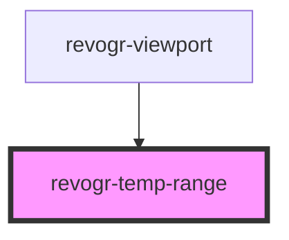

# revogr-focus

<!-- Auto Generated Below -->

## Properties

| Property         | Attribute | Description    | Type                                    | Default     |
| ---------------- | --------- | -------------- | --------------------------------------- | ----------- |
| `dimensionCol`   | --        |                | `ObservableMap<DimensionSettingsState>` | `undefined` |
| `dimensionRow`   | --        |                | `ObservableMap<DimensionSettingsState>` | `undefined` |
| `selectionStore` | --        | Dynamic stores | `ObservableMap<SelectionStoreState>`    | `undefined` |

## Dependencies

### Used by

 - [revogr-viewport](../viewport)

### Graph

----------------------------------------------

*Built with [StencilJS](https://stenciljs.com/)*
