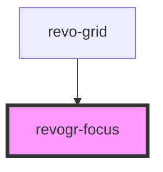

# revogr-focus

<!-- Auto Generated Below -->

## Properties

| Property         | Attribute  | Description    | Type                                      | Default     |
| ---------------- | ---------- | -------------- | ----------------------------------------- | ----------- |
| `colType`        | `col-type` |                | `"colPinEnd" \| "colPinStart" \| "rgCol"` | `undefined` |
| `dimensionCol`   | --         |                | `ObservableMap<DimensionSettingsState>`   | `undefined` |
| `dimensionRow`   | --         |                | `ObservableMap<DimensionSettingsState>`   | `undefined` |
| `rowType`        | `row-type` |                | `"rgRow" \| "rowPinEnd" \| "rowPinStart"` | `undefined` |
| `selectionStore` | --         | Dynamic stores | `ObservableMap<SelectionStoreState>`      | `undefined` |

## Events

| Event                 | Description | Type                            |
| --------------------- | ----------- | ------------------------------- |
| `before-focus-render` |             | `CustomEvent<FocusRenderEvent>` |

## Dependencies

### Used by

 - [revo-grid](../revoGrid)

### Graph

----------------------------------------------

*Built with [StencilJS](https://stenciljs.com/)*
