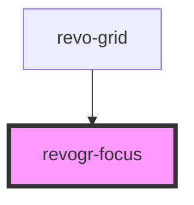

# revogr-focus

<!-- Auto Generated Below -->

## Properties

| Property                      | Attribute  | Description    | Type                                                                 | Default     |
| ----------------------------- | ---------- | -------------- | -------------------------------------------------------------------- | ----------- |
| `colData` _(required)_        | --         |                | `ObservableMap<DataSourceState<ColumnRegular, DimensionCols>>`       | `undefined` |
| `colType` _(required)_        | `col-type` |                | `"colPinEnd" \| "colPinStart" \| "rgCol"`                            | `undefined` |
| `dataStore` _(required)_      | --         |                | `ObservableMap<DataSourceState<DataType, DimensionRows>>`            | `undefined` |
| `dimensionCol` _(required)_   | --         |                | `ObservableMap<DimensionSettingsState>`                              | `undefined` |
| `dimensionRow` _(required)_   | --         |                | `ObservableMap<DimensionSettingsState>`                              | `undefined` |
| `focusTemplate`               | --         |                | `(createElement: HyperFunc<VNode>, detail: FocusRenderEvent) => any` | `null`      |
| `rowType` _(required)_        | `row-type` |                | `"rgRow" \| "rowPinEnd" \| "rowPinStart"`                            | `undefined` |
| `selectionStore` _(required)_ | --         | Dynamic stores | `ObservableMap<SelectionStoreState>`                                 | `undefined` |

## Events

| Event                 | Description                                       | Type                                                  |
| --------------------- | ------------------------------------------------- | ----------------------------------------------------- |
| `afterfocus`          | Used to setup properties after focus was rendered | `CustomEvent<{ model: any; column: ColumnRegular; }>` |
| `before-focus-render` |                                                   | `CustomEvent<FocusRenderEvent>`                       |

## Dependencies

### Used by

 - [revo-grid](../revoGrid)

### Graph

----------------------------------------------

*Built with [StencilJS](https://stenciljs.com/)*
