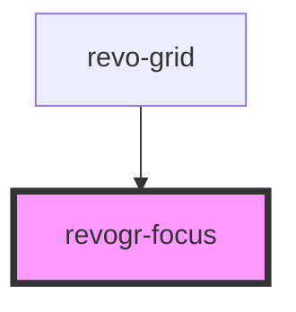

# revogr-focus

<!-- Auto Generated Below -->

## Overview

Focus component. Shows focus layer around the cell that is currently in focus.

## Properties

| Property                      | Attribute  | Description                                                               | Type                                                                 | Default     |
| ----------------------------- | ---------- | ------------------------------------------------------------------------- | -------------------------------------------------------------------- | ----------- |
| `colData` _(required)_        | --         | Column source                                                             | `ObservableMap<DSourceState<ColumnRegular, DimensionCols>>`          | `undefined` |
| `colType` _(required)_        | `col-type` | Column type                                                               | `"colPinEnd" \| "colPinStart" \| "rgCol"`                            | `undefined` |
| `dataStore` _(required)_      | --         | Data rows source                                                          | `ObservableMap<DSourceState<DataType, DimensionRows>>`               | `undefined` |
| `dimensionCol` _(required)_   | --         | Dimension settings X                                                      | `ObservableMap<DimensionSettingsState>`                              | `undefined` |
| `dimensionRow` _(required)_   | --         | Dimension settings Y                                                      | `ObservableMap<DimensionSettingsState>`                              | `undefined` |
| `focusTemplate`               | --         | Focus template custom function. Can be used to render custom focus layer. | `(createElement: HyperFunc<VNode>, detail: FocusRenderEvent) => any` | `null`      |
| `rowType` _(required)_        | `row-type` | Row type                                                                  | `"rgRow" \| "rowPinEnd" \| "rowPinStart"`                            | `undefined` |
| `selectionStore` _(required)_ | --         | Selection, range, focus for selection                                     | `ObservableMap<SelectionStoreState>`                                 | `undefined` |

## Events

| Event                  | Description                                                                                                               | Type                                                  |
| ---------------------- | ------------------------------------------------------------------------------------------------------------------------- | ----------------------------------------------------- |
| `afterfocus`           | Used to setup properties after focus was rendered                                                                         | `CustomEvent<{ model: any; column: ColumnRegular; }>` |
| `beforefocusrender`    | Before focus render event. Can be prevented by event.preventDefault(). If preventDefault used slot will be rendered.      | `CustomEvent<FocusRenderEvent>`                       |
| `beforescrollintoview` | Before focus changed verify if it's in view and scroll viewport into this view Can be prevented by event.preventDefault() | `CustomEvent<{ el: HTMLElement; }>`                   |

## Slots

| Slot                                 | Description |
| ------------------------------------ | ----------- |
| `"focus-${view.type}-${data.type}."` |             |

## Dependencies

### Used by

 - [revo-grid](../revoGrid)

### Graph

----------------------------------------------

*Built with love by Revolist OU*
