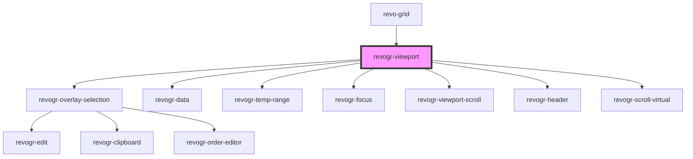

# revogr-viewport-scroll

<!-- Auto Generated Below -->

## Properties

| Property       | Attribute       | Description             | Type                                                                                                                                                                                                                                                                                                      | Default     |
| -------------- | --------------- | ----------------------- | --------------------------------------------------------------------------------------------------------------------------------------------------------------------------------------------------------------------------------------------------------------------------------------------------------- | ----------- |
| `columnFilter` | `column-filter` |                         | `boolean`                                                                                                                                                                                                                                                                                                 | `undefined` |
| `columnStores` | --              |                         | `{ colPinStart: ObservableMap<DataSourceState<ColumnRegular, DimensionCols>>; colPinEnd: ObservableMap<DataSourceState<ColumnRegular, DimensionCols>>; col: ObservableMap<DataSourceState<ColumnRegular, DimensionCols>>; }`                                                                              | `undefined` |
| `dimensions`   | --              |                         | `{ row: ObservableMap<DimensionSettingsState>; rowPinStart: ObservableMap<DimensionSettingsState>; rowPinEnd: ObservableMap<DimensionSettingsState>; colPinStart: ObservableMap<DimensionSettingsState>; colPinEnd: ObservableMap<DimensionSettingsState>; col: ObservableMap<DimensionSettingsState>; }` | `undefined` |
| `editors`      | --              | Custom editors register | `{ [name: string]: EditorCtr; }`                                                                                                                                                                                                                                                                          | `undefined` |
| `range`        | `range`         |                         | `boolean`                                                                                                                                                                                                                                                                                                 | `undefined` |
| `readonly`     | `readonly`      |                         | `boolean`                                                                                                                                                                                                                                                                                                 | `undefined` |
| `resize`       | `resize`        |                         | `boolean`                                                                                                                                                                                                                                                                                                 | `undefined` |
| `rowClass`     | `row-class`     |                         | `string`                                                                                                                                                                                                                                                                                                  | `undefined` |
| `rowHeaders`   | `row-headers`   | Show row indexes column | `RowHeaders \| boolean`                                                                                                                                                                                                                                                                                   | `undefined` |
| `rowStores`    | --              |                         | `{ row: ObservableMap<DataSourceState<DataType, DimensionRows>>; rowPinStart: ObservableMap<DataSourceState<DataType, DimensionRows>>; rowPinEnd: ObservableMap<DataSourceState<DataType, DimensionRows>>; }`                                                                                             | `undefined` |
| `uuid`         | `uuid`          |                         | `string`                                                                                                                                                                                                                                                                                                  | `null`      |
| `viewports`    | --              |                         | `{ row: ObservableMap<ViewportState>; rowPinStart: ObservableMap<ViewportState>; rowPinEnd: ObservableMap<ViewportState>; colPinStart: ObservableMap<ViewportState>; colPinEnd: ObservableMap<ViewportState>; col: ObservableMap<ViewportState>; }`                                                       | `undefined` |

## Events

| Event                   | Description | Type                                                                                                       |
| ----------------------- | ----------- | ---------------------------------------------------------------------------------------------------------- |
| `beforeEditStart`       |             | `CustomEvent<{ prop: ColumnProp; model: DataType; val?: string; rowIndex: number; type: DimensionRows; }>` |
| `initialRowDragStart`   |             | `CustomEvent<{ pos: PositionItem; text: string; }>`                                                        |
| `setDimensionSize`      |             | `CustomEvent<{ type: MultiDimensionType; sizes: Record<string, number>; }>`                                |
| `setViewportCoordinate` |             | `CustomEvent<{ dimension: DimensionType; coordinate: number; delta?: number; }>`                           |
| `setViewportSize`       |             | `CustomEvent<{ dimension: DimensionType; size: number; }>`                                                 |

## Methods

### `clearFocus() => Promise<void>`

Clear current grid focus

#### Returns

Type: `Promise<void>`

### `scrollToCoordinate(cell: Partial<Selection.Cell>) => Promise<void>`

#### Returns

Type: `Promise<void>`

### `setEdit(rowIndex: number, colIndex: number, colType: RevoGrid.DimensionCols, rowType: RevoGrid.DimensionRows) => Promise<void>`

#### Returns

Type: `Promise<void>`

## Dependencies

### Used by

 - [revo-grid](../revo-grid)

### Depends on

- [revogr-overlay-selection](../overlay)
- [revogr-data](../data)
- [revogr-temp-range](../selection-temp-range)
- [revogr-focus](../selection-focus)
- [revogr-viewport-scroll](../scroll)
- [revogr-header](../header)
- [revogr-scroll-virtual](../scrollable)

### Graph

----------------------------------------------

*Built with [StencilJS](https://stenciljs.com/)*
