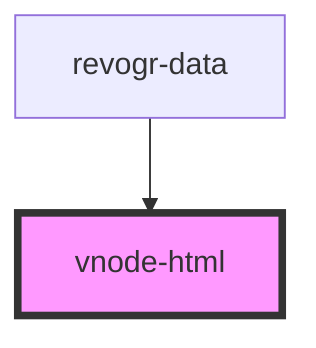

# vnode-html

<!-- Auto Generated Below -->

## Overview

VNode to html converter for stencil components.
Transform VNode to html string.

## Properties

| Property | Attribute | Description | Type            | Default |
| -------- | --------- | ----------- | --------------- | ------- |
| `redraw` | --        |             | `() => VNode[]` | `null`  |

## Events

| Event  | Description | Type                                              |
| ------ | ----------- | ------------------------------------------------- |
| `html` |             | `CustomEvent<{ html: string; vnodes: VNode[]; }>` |

## Dependencies

### Used by

 - [revogr-data](../data)

### Graph

----------------------------------------------

*Built with love by Revolist OU*
